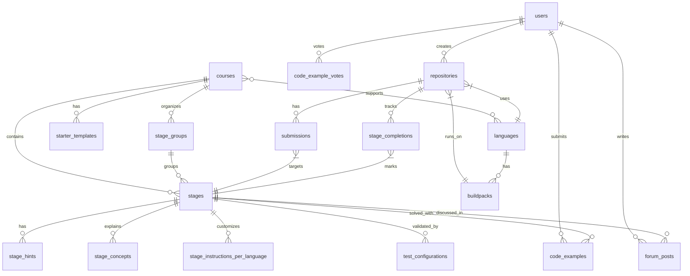

# Complete Database Schema Assumptions

## Core Entities

### `users`
| Column | Type | Notes |
|--------|------|-------|
| `id` | UUID (PK) | |
| `username` | VARCHAR(50) | Unique, used in URLs and leaderboards |
| `email` | VARCHAR(255) | From GitHub OAuth |
| `github_id` | BIGINT | GitHub user ID |
| `avatar_url` | TEXT | GitHub avatar |
| `display_name` | VARCHAR(100) | |
| `subscription_tier` | ENUM | `free`, `pro`, `team` |
| `subscription_expires_at` | TIMESTAMP | |
| `email_preferences` | JSONB | `{practice_reminders: true, marketing: false}` |
| `onboarding_completed` | BOOLEAN | |
| `practice_cadence` | VARCHAR(50) | "Every day", "A few times a week", etc. |
| `theme_preference` | ENUM | `dark`, `light`, `system` |
| `created_at` | TIMESTAMP | |
| `updated_at` | TIMESTAMP | |

### `courses`
| Column | Type | Notes |
|--------|------|-------|
| `id` | UUID (PK) | |
| `slug` | VARCHAR(50) | `shell`, `redis`, `git`, etc. |
| `title` | VARCHAR(200) | "Build your own Shell" |
| `short_description` | TEXT | Catalog card description |
| `long_description` | TEXT | Overview page description (Markdown) |
| `logo_url` | TEXT | Course icon/logo |
| `difficulty_rating` | ENUM | `beginner`, `intermediate`, `advanced` |
| `total_stages` | INTEGER | Computed/cached count |
| `is_free` | BOOLEAN | Default free access |
| `free_promotion_start` | TIMESTAMP | "Free this month" start |
| `free_promotion_end` | TIMESTAMP | "Free this month" end |
| `free_promotion_text` | VARCHAR(100) | "FREE THIS MONTH" |
| `position` | INTEGER | Ordering in catalog |
| `created_at` | TIMESTAMP | |
| `published_at` | TIMESTAMP | |

### `stage_groups`
| Column | Type | Notes |
|--------|------|-------|
| `id` | UUID (PK) | |
| `course_id` | UUID (FK) | → courses |
| `name` | VARCHAR(100) | "Base", "Navigation", "Quoting", etc. |
| `position` | INTEGER | Order in sidebar |
| `is_extension` | BOOLEAN | Extension stages (toggleable) |
| `default_enabled` | BOOLEAN | Whether the group is on by default |

### `stages`
| Column | Type | Notes |
|--------|------|-------|
| `id` | UUID (PK) | |
| `short_id` | CHAR(3) | `OO8`, `CZ2`, `FF0`, `PN5`, `IZ3` |
| `course_id` | UUID (FK) | → courses |
| `stage_group_id` | UUID (FK) | → stage_groups |
| `title` | VARCHAR(200) | "Print a prompt", "Handle invalid commands" |
| `difficulty` | ENUM | `VERY_EASY`, `EASY`, `MEDIUM`, `HARD` |
| `position` | INTEGER | Order within the course |
| `instructions_markdown` | TEXT | Main instruction content |
| `task_description` | TEXT | "Your Task" section |
| `example_input` | TEXT | Example input shown |
| `example_output` | TEXT | Example output shown |
| `is_published` | BOOLEAN | |
| `created_at` | TIMESTAMP | |
| `updated_at` | TIMESTAMP | |

### `stage_instructions_per_language`
| Column | Type | Notes |
|--------|------|-------|
| `id` | UUID (PK) | |
| `stage_id` | UUID (FK) | → stages |
| `language_id` | UUID (FK) | → languages |
| `instructions_markdown` | TEXT | Language-specific instructions |
| `file_path_hint` | VARCHAR(200) | e.g., "app/main.py" |
| `line_hint` | VARCHAR(100) | e.g., "uncomment lines 12-15" |

### `stage_hints`
| Column | Type | Notes |
|--------|------|-------|
| `id` | UUID (PK) | |
| `stage_id` | UUID (FK) | → stages |
| `position` | INTEGER | Hint order (1, 2, 3...) |
| `title` | VARCHAR(200) | "How do I read the user's command?" |
| `content_markdown` | TEXT | Hint body (code snippets, explanations) |

### `stage_concepts`
| Column | Type | Notes |
|--------|------|-------|
| `id` | UUID (PK) | |
| `stage_id` | UUID (FK) | → stages |
| `title` | VARCHAR(200) | "What is a shell prompt?" |
| `content_markdown` | TEXT | Concept tutorial content |
| `position` | INTEGER | |

### `languages`
| Column | Type | Notes |
|--------|------|-------|
| `id` | UUID (PK) | |
| `slug` | VARCHAR(20) | `python`, `rust`, `go`, etc. |
| `name` | VARCHAR(50) | "Python", "Rust", "Go" |
| `icon_url` | TEXT | Language logo |
| `is_popular` | BOOLEAN | Highlighted in UI |
| `position` | INTEGER | Display order |

### `course_languages` (many-to-many)
| Column | Type | Notes |
|--------|------|-------|
| `course_id` | UUID (FK) | → courses |
| `language_id` | UUID (FK) | → languages |
| `is_supported` | BOOLEAN | |

---

## Execution & Grading Entities

### `buildpacks`
| Column | Type | Notes |
|--------|------|-------|
| `id` | UUID (PK) | |
| `name` | VARCHAR(50) | `python-3.14`, `rust-1.77` |
| `language_id` | UUID (FK) | → languages |
| `docker_image` | TEXT | `codecrafters/buildpack-python:3.14` |
| `runtime_version` | VARCHAR(20) | `3.14` |
| `is_default` | BOOLEAN | Default for new repos |
| `is_active` | BOOLEAN | Available for selection |

### `starter_templates`
| Column | Type | Notes |
|--------|------|-------|
| `id` | UUID (PK) | |
| `course_id` | UUID (FK) | → courses |
| `language_id` | UUID (FK) | → languages |
| `compile_script` | TEXT | Content of `.codecrafters/compile.sh` |
| `run_script` | TEXT | Content of `.codecrafters/run.sh` |
| `starter_files` | JSONB | `{"app/main.py": "import sys...", "pyproject.toml": "..."}` |
| `config_yml` | TEXT | Content of `codecrafters.yml` |
| `readme_template` | TEXT | README.md with badge placeholder |

### `test_configurations`
| Column | Type | Notes |
|--------|------|-------|
| `id` | UUID (PK) | |
| `stage_id` | UUID (FK) | → stages |
| `tester_binary_url` | TEXT | URL to download the tester |
| `test_scenarios` | JSONB | Structured test definition |
| `randomization_config` | JSONB | Template variable definitions |
| `timeout_ms` | INTEGER | Default: 5000 |
| `max_retries` | INTEGER | Default: 0 |

---

## User Progress Entities

### `repositories`
| Column | Type | Notes |
|--------|------|-------|
| `id` | UUID (PK) | `d1fe6aab-9b89-461e-8e5a-413b3205d78b` |
| `user_id` | UUID (FK) | → users |
| `course_id` | UUID (FK) | → courses |
| `language_id` | UUID (FK) | → languages |
| `git_slug` | CHAR(16) | `23e6d7439485685e` |
| `current_stage_id` | UUID (FK) | → stages |
| `buildpack_id` | UUID (FK) | → buildpacks |
| `is_active` | BOOLEAN | |
| `proficiency_level` | ENUM | `beginner`, `intermediate`, `advanced` |
| `created_at` | TIMESTAMP | |
| `last_submission_at` | TIMESTAMP | |

### `stage_completions`
| Column | Type | Notes |
|--------|------|-------|
| `id` | UUID (PK) | |
| `repository_id` | UUID (FK) | → repositories |
| `stage_id` | UUID (FK) | → stages |
| `completed_at` | TIMESTAMP | |
| `submission_id` | UUID (FK) | → submissions (the passing submission) |
| `attempts_count` | INTEGER | Number of submissions before passing |

### `submissions`
| Column | Type | Notes |
|--------|------|-------|
| `id` | UUID (PK) | |
| `repository_id` | UUID (FK) | → repositories |
| `target_stage_id` | UUID (FK) | → stages (the stage being tested) |
| `commit_hash` | CHAR(40) | Git commit SHA |
| `status` | ENUM | `pending`, `running`, `passed`, `failed`, `error` |
| `is_turbo` | BOOLEAN | Whether turbo tests were used |
| `test_logs` | TEXT | Full test output |
| `duration_ms` | INTEGER | Total execution time |
| `failure_stage_id` | UUID (FK) | → stages (if failed, which stage) |
| `failure_message` | TEXT | Error diff message |
| `worker_id` | VARCHAR(50) | Which worker processed this |
| `created_at` | TIMESTAMP | |
| `completed_at` | TIMESTAMP | |

---

## Leaderboard Entities

### `leaderboard_entries` (materialized view or cached table)
| Column | Type | Notes |
|--------|------|-------|
| `user_id` | UUID (FK) | → users |
| `course_id` | UUID (FK) | → courses |
| `language_id` | UUID (FK) | → languages |
| `stages_completed` | INTEGER | |
| `last_completion_at` | TIMESTAMP | |
| `rank` | INTEGER | Computed, indexed |

---

## Social & Community Entities

### `code_examples`
| Column | Type | Notes |
|--------|------|-------|
| `id` | UUID (PK) | |
| `stage_id` | UUID (FK) | → stages |
| `user_id` | UUID (FK) | → users |
| `language_id` | UUID (FK) | → languages |
| `code_content` | TEXT | The solution code |
| `helpful_votes` | INTEGER | |
| `not_helpful_votes` | INTEGER | |
| `is_approved` | BOOLEAN | Admin moderation |
| `created_at` | TIMESTAMP | |

### `code_example_votes`
| Column | Type | Notes |
|--------|------|-------|
| `id` | UUID (PK) | |
| `code_example_id` | UUID (FK) | → code_examples |
| `user_id` | UUID (FK) | → users |
| `is_helpful` | BOOLEAN | |
| `created_at` | TIMESTAMP | |

### `forum_posts`
| Column | Type | Notes |
|--------|------|-------|
| `id` | UUID (PK) | |
| `stage_id` | UUID (FK) | → stages |
| `user_id` | UUID (FK) | → users |
| `title` | VARCHAR(200) | |
| `body_markdown` | TEXT | |
| `parent_id` | UUID (FK) | → forum_posts (for replies) |
| `created_at` | TIMESTAMP | |

---

## Entity Relationship Diagram

